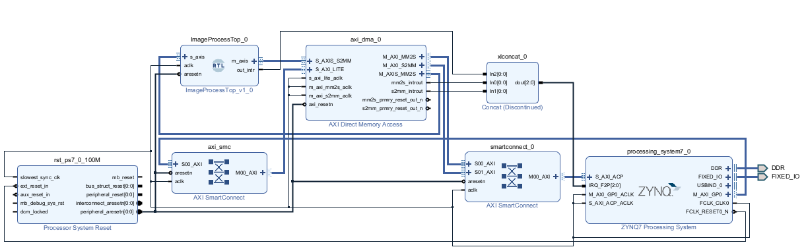

# zynq-image-processing

A pipelined 3×3 image convolution engine written in RTL Verilog and verified
with a UVM testbench. Targeting Zynq-7000 SoC using Vivado for RTL synthesis and Vitis for firmware. 
RTL is portable to any AXI4-Stream capable Xilinx device. Images must be 512×512 grayscale BMP files (example provided).

---

## Features

- **Configurable 3×3 kernel** — signed 8-bit coefficients support smoothing
  filters (box blur, Gaussian) and derivative filters (Sobel, Laplacian).
- **Saturating output** — post-normalisation results are clamped to \[0, 255\]
  rather than wrapping, producing correct output for mixed-sign kernels.
- **AXI4-Stream I/O** — slave input and master output use standard
  `tvalid/tready/tdata` handshaking, allowing for straightforward
  integration into a Zynq PS-PL pipeline via AXI DMA.
- **Circular line buffer architecture** — four rotating line buffers avoid the need to copy or shift row data; only the read/write index
  advances between rows.
- **UVM testbench** — stimulus, monitoring, and checking are structured into
  UVM components (agent, driver, monitor, scoreboard) to reflect
  industry-standard verification methodology.

---

## Architecture

```
                    AXI4-Stream slave
                         │
                   ┌─────▼──────┐  4 line buffers stream
                   | BufferCtrl |  72-bit 3×3 pixel windows
                   │            │  once 3 full rows are buffered
                   └─────┬──────┘  
                         │ 72-bit pixel window (9 × 8-bit pixels)
                   ┌─────▼──────┐
                   │    Conv    │  signed 3×3 kernel multiply-accumulate
                   │            │  saturating normalisation
                   └─────┬──────┘
                         │ 8-bit convolved pixel
                   ┌─────▼──────┐
                   │outputBuffer│  Xilinx AXI-stream FIFO IP
                   │  (FIFO)    │  back-pressure via axis_prog_full
                   └─────┬──────┘
                         │
                    AXI4-Stream master
```


## Repository Structure

```
zynq-image-processing/
├── rtl/          synthesisable Verilog
├── tb/           testbench — agent, driver, monitor, scoreboard, sequences, sample image
├── bd/           Vivado block diagram
├── ip/           Xilinx IP configurations
├── firmware/     Vitis application firmware
├── scripts/      utility scripts
├── docs/         supplementary documentation
└── README.md
```

---

## Simulation

The testbench reads a 512×512 greyscale BMP (`input.bmp`), streams all
pixels through the DUT, and writes the convolved result to `output.bmp`.
The UVM scoreboard verifies that exactly 262,144 pixels are received and
that no X or Z values appear on the output.

*UVM was chosen over a basic self-checking testbench to build familiarity
with the component hierarchy and methodology used in industry verification
environments. For a design of this size it is admittedly heavier than
necessary, but the structure scales cleanly to more complex designs.

**Requirements:**
- Vivado project with RTL and testbench files
- A 512×512 greyscale BMP  `input.bmp` in the simulation working directory (`<project>.sim/sim_1/behav/xsim/`).

**Steps (Vivado GUI):**
1. Set `tb_top.sv` as the top-level simulation source.
2. Copy `input.bmp` into the simulation working directory
3. Run behavioral simulation. The scoreboard will report pass/fail in the
   Tcl console on completion. Check `output.bmp` in simulation directory to verify the kernel was applied to the image.

---


## PS-PL System Integration


*Vivado block design — ImageProcessTop connected to the Zynq-7000 PS via AXI DMA and AXI Interconnect*


## Hardware Target

| | |
|---|---|
| Board | Digilent Arty Z7-20 |
| SoC | Xilinx Zynq-7000 (XC7Z020) |
| RTL toolchain | Vivado |
| Firmware | Vitis |